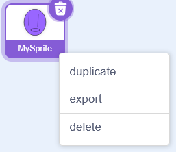
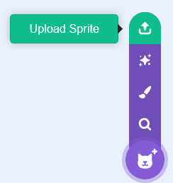
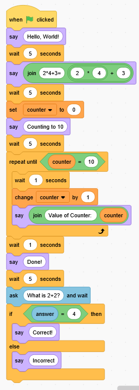

# lascra (Lisp and Scratch)
lascra is a compiler that compiles a lisp like language into scratch sprite3 files  

[](https://github.com/bit-turtle/lascra/actions/workflows/buildexamples.yml)
## Information
* Documentation in [`docs`](docs/STRUCTURE.md) folder
* Examples in the [`examples`](examples/) folder
* All base scratch blocks are supported
* Some blocks from extensions are supported
  - Pen extension is fully supported
* A web version can be compiled using Emscripten  
## Usage
`lascra *.sprite3 (--sprite spriteName) [--remove,--keep] codeFiles...`
* Opens `sprite.json` in `sprite.sprite3`
  - `--sprite spriteName`: Opens the `spriteName` sprite in `project.json` in `project.sb3`
* Deletes existing lascra-generated code
  - `--remove`: Removes all existing code
  - `--keep`: Keeps all existing code
* Compiles code files
* Save generated code
## Example Usage
1. Export a Sprite in the scratch editor called "MySprite"  

2. Run `lascra MySprite.sprite3 examples/example.scra`
Contents of `example.scra`:
```
(declare
    (name MySprite)
)
(define
    (variable counter 0)
)
(procedure say_wait (Say (string message) and wait for (number seconds) seconds)
    (say (argument message) )
    (wait (argument seconds) )
)
(when flag
    (call say_wait "Hello World!" 15)
    (say (join
        "2*4+3="
        (+ (* 2 4) 3)
    ) )
    (wait 5)
    (set counter 0)
    (say "Counting to 10")
    (wait 5)
    (repeat_until (= (variable counter) 10)
        (wait 1)
        (change counter 1)
        (say (join
            "Value of Counter: "
            (variable counter)
        ) )
    )
    (wait 1)
    (say "Done!")
    (wait 5)
    (ask "What is 2+2?")
    (if (= (value answer) 4)
        (say "Correct!")
    )
    (elif (= (value answer) 0)
        (say "That would be for subtraction")
    )
    (else
        (say "Incorrect")
    )
)
```
3. Upload the edited Sprite file in the scratch editor  


This results in the following code:  

